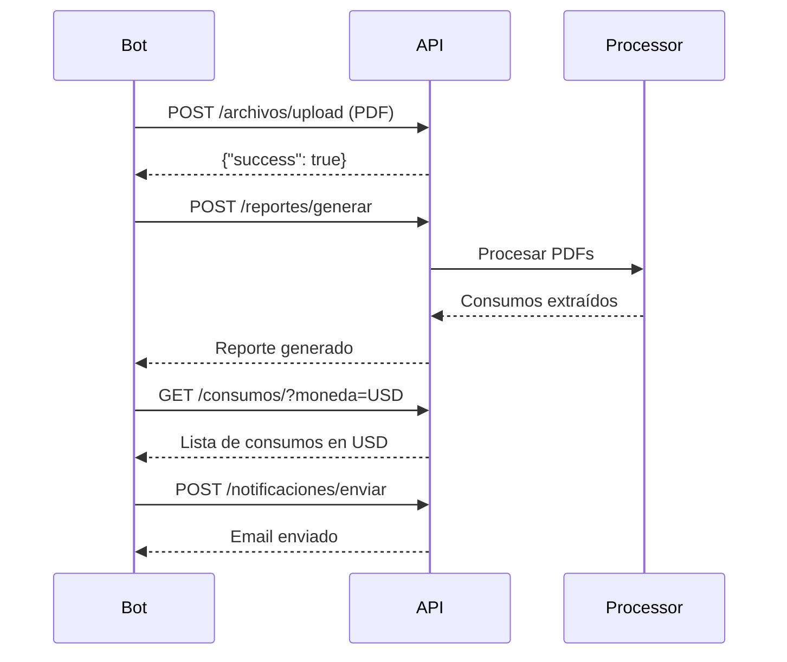

# API REST - Personal Finance App

## Descripción

API REST desarrollada con FastAPI para exponer las funcionalidades del procesador de resúmenes de tarjetas de crédito. Permite a bots y aplicaciones externas interactuar con el sistema.

## Instalación

```bash
# Instalar dependencias
pip install -r requirements.txt

# Iniciar el servidor
uvicorn api.app:app --reload --host 0.0.0.0 --port 8000
```

## Endpoints Disponibles

### 📊 Reportes

| Método | Endpoint | Descripción |
|--------|----------|-------------|
| `POST` | `/reportes/generar` | Genera reporte procesando todos los PDFs |
| `GET` | `/reportes/ultimo` | Obtiene información del último reporte |

#### Generar Reporte
```bash
curl -X POST "http://localhost:8000/reportes/generar" \
  -H "Content-Type: application/json" \
  -d '{"enviar_email": false}'
```

**Response:**
```json
{
  "success": true,
  "message": "Reporte generado exitosamente con 45 consumos",
  "total_consumos": 45,
  "total_archivos_procesados": 3,
  "archivos_con_error": [],
  "cotizacion_dolar": 1050.00,
  "fecha_proceso": "2026-02-26T10:30:00",
  "resumen_por_categoria": [
    {"categoria": "Food", "cantidad": 15, "monto_total": 125000.00, "porcentaje": 35.5}
  ],
  "resumen_por_moneda": {"ARS": {"cantidad": 40, "monto": 300000}, "USD": {"cantidad": 5, "monto": 500}}
}
```

---

### 📁 Archivos

| Método | Endpoint | Descripción |
|--------|----------|-------------|
| `GET` | `/archivos/` | Lista todos los PDFs cargados |
| `POST` | `/archivos/upload` | Sube un archivo PDF |
| `POST` | `/archivos/upload-multiple` | Sube múltiples PDFs |
| `DELETE` | `/archivos/{nombre}` | Elimina un PDF |

#### Cargar Resumen
```bash
curl -X POST "http://localhost:8000/archivos/upload" \
  -F "archivo=@resumen-visa.pdf"
```

#### Cargar Múltiples Resúmenes
```bash
curl -X POST "http://localhost:8000/archivos/upload-multiple" \
  -F "archivos=@visa.pdf" \
  -F "archivos=@mastercard.pdf"
```

---

### 💰 Consumos

| Método | Endpoint | Descripción |
|--------|----------|-------------|
| `GET` | `/consumos/` | Lista consumos con filtros opcionales |
| `GET` | `/consumos/resumen` | Resumen estadístico de consumos |
| `GET` | `/consumos/categorias` | Resumen de consumos por todas las categorías |
| `GET` | `/consumos/categorias/{categoria}` | Consumos de una categoría específica |

#### Obtener Consumos
```bash
# Todos los consumos
curl "http://localhost:8000/consumos/"

# Filtrar por moneda
curl "http://localhost:8000/consumos/?moneda=USD"

# Filtrar por categoría
curl "http://localhost:8000/consumos/?categoria=Food"
```

#### Resumen por Categorías
```bash
curl "http://localhost:8000/consumos/categorias"
```

**Response:**
```json
{
  "success": true,
  "message": "Resumen de 6 categorías",
  "total_consumos": 45,
  "monto_total_general": 350000.00,
  "cotizacion_dolar": 1050.00,
  "fecha_consulta": "2026-02-26T10:30:00",
  "categorias": [
    {"categoria": "Food", "cantidad": 15, "monto_total": 125000.00, "porcentaje": 35.5},
    {"categoria": "Utilities", "cantidad": 10, "monto_total": 80000.00, "porcentaje": 22.8}
  ]
}
```

#### Consumos por Categoría Específica
```bash
# Todos los consumos de Food
curl "http://localhost:8000/consumos/categorias/Food"

# Consumos de Food en USD
curl "http://localhost:8000/consumos/categorias/Food?moneda=USD"
```

**Response:**
```json
{
  "success": true,
  "message": "Se encontraron 15 consumos en 'Food'",
  "categoria": "Food",
  "total_consumos": 15,
  "monto_total": 125000.00,
  "monto_total_pesificado": 125000.00,
  "porcentaje_del_total": 35.5,
  "consumos": [...]
}
```

---

### 💵 Cotización

| Método | Endpoint | Descripción |
|--------|----------|-------------|
| `GET` | `/cotizacion/dolar` | Obtiene cotización del dólar oficial |

```bash
curl "http://localhost:8000/cotizacion/dolar"
```

**Response:**
```json
{
  "success": true,
  "cotizacion_venta": 1050.00,
  "cotizacion_compra": null,
  "fuente": "dolarapi.com",
  "fecha_consulta": "2026-02-26T10:30:00"
}
```

---

### 📧 Notificaciones

| Método | Endpoint | Descripción |
|--------|----------|-------------|
| `POST` | `/notificaciones/enviar` | Envía reporte por email |
| `GET` | `/notificaciones/estado` | Estado de configuración |
| `GET` | `/notificaciones/preferencias` | Obtiene preferencias de notificación |
| `PUT` | `/notificaciones/preferencias` | Actualiza preferencias de notificación |
| `POST` | `/notificaciones/suscribir` | Activa las notificaciones |
| `POST` | `/notificaciones/desuscribir` | Desactiva las notificaciones |

#### Enviar Email
```bash
curl -X POST "http://localhost:8000/notificaciones/enviar" \
  -H "Content-Type: application/json" \
  -d '{"tipo": "email"}'
```

#### Obtener Preferencias
```bash
curl "http://localhost:8000/notificaciones/preferencias"
```

**Response:**
```json
{
  "success": true,
  "message": "Preferencias obtenidas correctamente",
  "preferencias": {
    "habilitado": true,
    "tipo": "email",
    "email_destino_display": "use***@gmail.com",
    "envio_automatico": false,
    "incluir_resumen": true,
    "incluir_detalle": true
  }
}
```

#### Actualizar Preferencias
```bash
curl -X PUT "http://localhost:8000/notificaciones/preferencias" \
  -H "Content-Type: application/json" \
  -d '{
    "habilitado": true,
    "tipo": "email",
    "email_destino": "nuevo@email.com",
    "envio_automatico": true,
    "incluir_resumen": true,
    "incluir_detalle": false
  }'
```

#### Suscribirse/Desuscribirse
```bash
# Suscribirse (activar notificaciones)
curl -X POST "http://localhost:8000/notificaciones/suscribir"

# Desuscribirse (desactivar notificaciones)
curl -X POST "http://localhost:8000/notificaciones/desuscribir"
```

---

### 🏷️ Categorías

| Método | Endpoint | Descripción |
|--------|----------|-------------|
| `GET` | `/categorias/` | Lista categorías disponibles |

```bash
curl "http://localhost:8000/categorias/"
```

---

### ❤️ Health Check

| Método | Endpoint | Descripción |
|--------|----------|-------------|
| `GET` | `/` | Información básica de la API |
| `GET` | `/health` | Estado de salud de la API |

---

## Documentación Interactiva

La API incluye documentación interactiva:

- **Swagger UI**: http://localhost:8000/docs
- **ReDoc**: http://localhost:8000/redoc

---

## Flujo de Uso Típico



---

## Variables de Entorno Requeridas

```env
# Contraseña para PDFs protegidos
PDF_PASSWORD=tu_password

# Configuración de email
NOTIFICATION_ENABLED=1
NOTIFICATION_TYPE=email
EMAIL_TO=tu@email.com
RESEND_API_KEY=re_xxxxx
EMAIL_FROM=noreply@tudominio.com
```

---

## Errores Comunes

| Código | Descripción | Solución |
|--------|-------------|----------|
| 400 | Archivo no es PDF | Verificar extensión del archivo |
| 404 | No hay consumos | Generar un reporte primero |
| 500 | Error interno | Ver logs en `api.log` |

---

## Logs

Los logs de la API se guardan en:
- `api.log` - Logs de la API REST
- `procesamiento_consumos.log` - Logs del procesador de PDFs

